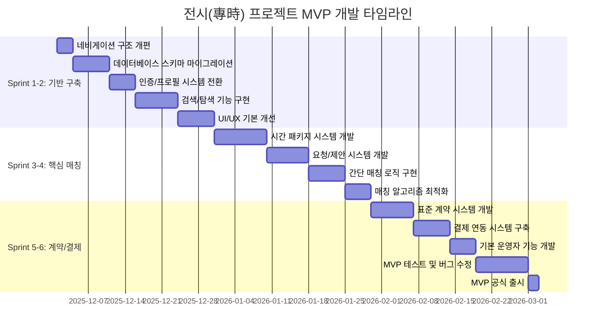
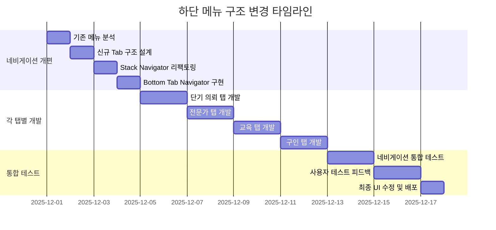

# 7. 전시(專時) 프로젝트 변경 계획

Change Management Plan for CertMatch → 전시(專時) Transformation

---

## 1. 📄 문서 개요

| 항목 | 내용 |
| --- | --- |
| **프로젝트명** | CertMatch → **전시(專時) - 전문가 유휴시간 파트타임/프리랜서 매칭 플랫폼** |
| **버전** | v1.0 (변경 계획) |
| **작성일** | 2025년 11월 30일 |
| **책임자** | [개발팀/기획팀] |
| **목표 기간** | 3개월 (MVP 출시) |
| **우선순위** | Phase 1 (핵심 기능) → Phase 2 (고도화) |

## 2. 🎯 변경 비전 및 목표

### 2.1 핵심 변경 방향

> **"인증 전문가 매칭 → 전문가 유휴시간 자산화 플랫폼"**

* **도메인 전환**: 인증/심사 기반 → **시간 패키지 기반 파트타임 매칭**
* **타겟 전환**: 인증 대기업 → **스타트업/중소기업 + 시니어 전문가**
* **비즈니스 모델**: 인증 수수료 → **시간 패키지 매칭 수수료 + 구독 모델**

### 2.2 MVP 성공 목표 (3개월)

* 활성 전문가 프로필: **300개**
* 활성 기업 계정: **150개**
* 월 매칭(계약 체결) 건수: **30건 이상**
* 매칭 후 재계약률: **30% 이상**
* 사용자 만족도: **4.5/5 이상**

## 3. 🏗️ 기술 아키텍처 변경 전략

### 3.1 기존 인프라 활용 (✅ 유지)

#### Backend (Server/)
* **NestJS + Prisma + PostgreSQL** 구조 유지
* **JWT 인증 시스템** 재활용
* **Zod 검증 + Swagger API 문서** 유지
* **파일 업로드 모듈** 활용 (포트폴리오 관리)

#### Mobile Frontend (mobile_front/)
* **React Native + Expo** 기술 스택 유지
* **Redux Toolkit 상태 관리** 재활용
* **nativewind UI 프레임워크** 유지
* **Axios API 통신 모듈** 재사용

### 3.2 데이터베이스 스키마 변경

#### 기존 테이블 재활용 (🔄 컬럼 추가/수정)
* **users** → 역할(expert/company) 유지, 추가 필드 필요
* **companies** → 기업 정보 관리 (그대로 활용)
* **experts** → 전문가 프로필 (시간 패키지 정보 추가)
* **expert_recruitment** → 채용 공고 (그대로 활용)
* **qa_answers**, **settings**, **banner_management** → 유지

#### 신규 테이블 추가 (🆕)
```sql
-- 시간 패키지 관리
time_packages
- id, expert_id, name, type(weekly/monthly/session)
- price, description, working_hours, communication_method
- min_contract_period, status

-- 시간 패키지 요청/제안
package_requests
- id, company_id, expert_id, package_id
- request_details, proposed_price, status
- created_at, updated_at

-- 계약 관리
contracts
- id, package_request_id, start_date, end_date
- total_amount, platform_fee, status
- payment_id, contract_terms

-- 매칭 추천 로그
matching_logs
- id, company_id, expert_id, matching_score
- request_criteria, created_at
```

## 4. 📱 모바일 앱 변경 계획

### 4.1 하단 메뉴 구조 변경 (Bottom Tab)

```typescript
// 기존: 홈, 컨설턴트, 교육, 공지, 마이페이지
// 변경: 단기 의뢰 , 전문가, 교육, 구인
const TabNavigator = () => {
  return (
    <Tab.Navigator>
      <Tab.Screen
        name="ProjectsHiring"
        component={ProjectsHiringStack}
        options={{ title: '단기 의뢰' }}
      />
      <Tab.Screen
        name="Experts"
        component={ExpertsStack}
        options={{ title: '전문가' }}
      />
      <Tab.Screen
        name="Education"
        component={EducationStack}
        options={{ title: '교육' }}
      />
      <Tab.Screen
        name="Community"
        component={CommunityStack}
        options={{ title: '구인' }}
      />
    </Tab.Navigator>
  );
};
```

### 4.2 기존 컴포넌트 재활용 전략

#### ✅ 그대로 활용 (라벨/카피만 변경)
* `LoginScreen`, `SignupScreen` → 안내 문구만 전시 컨셉으로 변경
* `PersonalRegistrationEdit` → 전문가 기본 프로필 관리
* `CompanyRegistrationEdit` → 기업 정보 관리
* `ExpertRecruitmentList` → 채용 공고 리스트
* `ExpertRecruitmentListDetail` → 채용 공고 상세
* `InputExpertRecruitment` → 구인 공고 등록/수정
* `EducationList`, `EduListDetail` → 교육 관리
* `NoticeNewsList`, `QnaList` → 공지/커뮤니티
* `Settings`, `AlarmManagement` → 설정 관리

#### 🔄 UI/UX 개선 (전시 컨셉 반영)
* `HomeScreen` → 서비스 소개 + 추천 전문가/공고 카드
* `ExpertProfessionalList` → 전문가 리스트 (필터 강화)
* `ProfessionalistDetail` → 전문가 상세 (시간 패키지 섹션 추가)
* `ScheduleManager` → 유휴시간 설정 (업무 가능 시간 블록)
* `MyPagePerson`, `MyPageCorperation` → 대시보드 기능 강화

#### 🆕 신규 개발 (전시 핵심 기능)
```typescript
// 시간 패키지 관리
TimePackageList.tsx      // 시간 패키지 목록
TimePackageForm.tsx       // 시간 패키지 등록/수정
TimePackageDetail.tsx      // 시간 패키지 상세

// 요청/계약 관리
PackageRequestList.tsx     // 받은 요청 목록 (전문가)
RequestManagement.tsx      // 보낸 요청 관리 (기업)
ContractList.tsx           // 계약 목록
ContractDetail.tsx         // 계약 상세

// 메시징 (Phase 2)
MessageList.tsx           // 메시지 목록
MessageRoom.tsx           // 1:1 채팅방

// 매칭/추천
MatchingRecommendations.tsx // AI 추천 전문가
MatchingFilters.tsx         // 상세 검색 필터
```

## 5. 🔧 Backend API 변경 계획

### 5.1 기존 API 재활용

#### Auth Module (그대로 활용)
* `POST /auth/register`, `/auth/login` → 역할 선택은 유지
* `JWT Guards`, `Local Strategy` → 그대로 활용

#### Users/Companies/Experts Modules (🔄 확장)
* `GET/POST/PATCH /users` → 전문가/기업 정보 관리
* `GET/POST/PATCH /companies` → 기업 관리 (그대로)
* `GET/POST/PATCH /experts` → 전문가 관리 (시간 패키지 필드 추가)

### 5.2 신규 API 개발 (전시 핵심)

#### Time Packages Module
```typescript
// 시간 패키지 CRUD
GET /time-packages          // 전문가 시간 패키지 목록
POST /time-packages         // 시간 패키지 등록
PATCH /time-packages/:id    // 시간 패키지 수정
DELETE /time-packages/:id   // 시간 패키지 삭제
GET /time-packages/:id      // 시간 패키지 상세
```

#### Package Requests Module
```typescript
// 시간 패키지 요청/제안
POST /package-requests         // 기업 → 전문가 요청
GET /package-requests/sent     // 보낸 요청 목록 (기업)
GET /package-requests/received // 받은 요청 목록 (전문가)
POST /package-requests/:id/proposals // 전문가 제안 전송
PATCH /package-requests/:id   // 요청 상태 변경
```

#### Contracts Module
```typescript
// 계약 관리
POST /contracts               // 계약 생성
GET /contracts                // 계약 목록
GET /contracts/:id           // 계약 상세
PATCH /contracts/:id/status  // 계약 상태 변경
```

#### Matching Module
```typescript
// 매칭/추천
POST /matching/recommend      // 기업 요청 기반 추천
GET /matching/recommendations/:expertId // 전문가 추천 목록
POST /matching/search         // 전문가 검색 (상세 필터)
```

### 5.3 Database Schema 업데이트

#### Prisma Schema 수정
```prisma
// 기존 Expert 모델 확장
model Expert {
  id          String   @id @default(uuid())
  userId      String   @unique
  user        User     @relation(fields: [userId], references: [id])

  // 기존 필드
  companyName String?
  position    String?
  experience  String?
  description String?
  tags        String[] // JSON array

  // 전시 추가 필드
  hourlyRate  Int?      // 시간당 단가
  availableHours Json?  // 가용시간 정보
  portfolioLinks Json?  // 포트폴리오 링크

  // 관계 추가
  timePackages TimePackage[]
  packageRequests PackageRequest[]
  contracts Contract[]

  createdAt   DateTime @default(now())
  updatedAt   DateTime @updatedAt
}

// 신규 모델 추가
model TimePackage {
  id                   String    @id @default(uuid())
  expertId             String
  expert               Expert    @relation(fields: [expertId], references: [id])

  name                 String    // "주 10시간 CMO"
  type                 String    // weekly/monthly/session
  price                Int        // 패키지 가격
  description          String    // 포함 업무 범위
  workingHours         Int       // 제공 시간
  communicationMethod  String    // 채팅/미팅 등
  minContractPeriod    Int?      // 최소 계약 기간 (주)
  status               String    @default("active")

  packageRequests      PackageRequest[]
  contracts            Contract[]

  createdAt            DateTime @default(now())
  updatedAt            DateTime @updatedAt
}

model PackageRequest {
  id               String    @id @default(uuid())
  companyId        String
  company          Company   @relation(fields: [companyId], references: [id])
  expertId         String?
  expert           Expert?   @relation(fields: [expertId], references: [id])
  packageId        String?
  package          TimePackage? @relation(fields: [packageId], references: [id])

  title            String    // 요청 제목
  description      String    // 상세 요청사항
  proposedPrice    Int?      // 기업 제안가
  budget           Int?      // 예산
  duration         Int?      // 원하는 기간 (주)
  status           String    @default("pending") // pending/accepted/rejected

  proposals        Json?     // 전문가 제안들

  contracts        Contract[]

  createdAt        DateTime @default(now())
  updatedAt        DateTime @updatedAt
}

model Contract {
  id                String    @id @default(uuid())
  packageRequestId  String
  packageRequest    PackageRequest @relation(fields: [packageRequestId], references: [id])
  expertId          String
  expert            Expert    @relation(fields: [expertId], references: [id])
  companyId         String

  startDate         DateTime
  endDate           DateTime
  totalAmount       Int       // 총 계약 금액
  platformFee       Int       // 플랫폼 수수료
  expertAmount      Int       // 전문가 실수령액

  status            String    @default("pending") // pending/active/completed/cancelled
  paymentStatus     String    @default("pending") // pending/paid/refunded

  contractTerms     Json      // 계약 약관

  createdAt         DateTime @default(now())
  updatedAt         DateTime @updatedAt
}
```

## 6. 🚀 Phase별 개발 계획

### 6.1 Phase 1: MVP 핵심 기능 (0~3개월)

#### Sprint 1-2: 기반 구축 (1개월)
* **데이터베이스 스키마 마이그레이션**
  * 기존 테이블 필드 추가 (Expert.timePackages 등)
  * 신규 테이블 생성 (TimePackage, PackageRequest, Contract)
* **인증/프로필 시스템 전환**
  * 라벨/카피 변경: "인증" → "전문가/기업"
  * 전문가 프로필: 시간 패키지 등록 기능 추가
  * 유휴시간 설정 기능 개선
* **검색/탐색 기능**
  * 통합 검색 시스템 구현
  * 전문가 필터링 기능 강화
  * 채용 공고 검색 기능 유지

#### Sprint 3-4: 핵심 매칭 기능 (1개월)
* **시간 패키지 시스템**
  * 시간 패키지 등록/수정/삭제
  * 시간 패키지 목록/상세 조회
  * 패키지 기반 전문가 추천
* **요청/제안 시스템**
  * 기업 → 전문가 요청 기능
  * 전문가 → 제안 전송 기능
  * 요청/제안 상태 관리
* **간단 매칭 로직**
  * 역할/경력/가격 기반 적합도 계산
  * 추천 리스트 정렬 및 필터링

#### Sprint 5-6: 계약/결제 기능 (1개월)
* **표준 계약 시스템**
  * 계약서 템플릿 생성
  * 계약 생성/승인/관리
  * 계약 상태 추적
* **결제 연동**
  * 간단 결제 플로우 (카드/계좌이체)
  * 플랫폼 수수료 자동 계산
  * 영수증/세금계산서 기본 처리
* **기본 운영자 기능**
  * 사용자/거래 목록 조회
  * 기본 통계 대시보드
  * 신고/분쟁 접수 기능

### 6.2 Phase 2: 고도화 (3~6개월)

#### Sprint 7-8: UI/UX 개선
* **대시보드 강화**
  * 전문가: 수입/계약 현황 시각화
  * 기업: 지출/진행중 계약 관리
* **필터/검색 고도화**
  * 상세 필터 옵션 (시간대/평점/응답률)
  * 검색 결과 정렬 개선
* **모바일 UX 최적화**
  * 로딩 속도 개선
  * 네비게이션 개선

#### Sprint 9-10: 메시징 & 협업
* **1:1 메시징 시스템**
  * 실시간 채팅 기능
  * 파일/이미지 공유
  * 알림 시스템 연동
* **협업 도구**
  * 간단한 타임트래킹
  * 캘린더 연동
  * 미팅 예약 기능

#### Sprint 11-12: 추천 알고리즘 고도화
* **AI 기반 매칭**
  * 행동 데이터 기반 추천
  * 개인화된 추천 로직
  * 매칭 정확도 개선
* **분석/리포트**
  * 사용자 행동 분석
  * 매칭 성공률 추적
  * A/B 테스트 기능

## 7. 📊 데이터 마이그레이션 계획

### 7.1 기존 데이터 처리

#### 유지 데이터 (✅)
* **사용자 계정 정보**: email, password, role (expert/company)
* **기업 정보**: company_name, description, contact_info
* **전문가 기본 정보**: name, position, experience, tags
* **채용 공고**: job descriptions, requirements, contact_info

#### 전환 데이터 (🔄)
* **전문가 태그**: 인증 분야 → 전문 분야 (marketing, finance, hr, pm 등)
* **포트폴리오**: 기존 파일 링크 → portfolio_links 필드로 통합
* **가용시간**: 기존 스케줄 → availableHours JSON 형식으로 변환

#### 초기 데이터 시딩
```sql
-- 샘플 시간 패키지 데이터
INSERT INTO time_packages (expert_id, name, type, price, description, working_hours)
SELECT
  e.id,
  '주 10시간 ' || e.position,
  'weekly',
  e.experience::integer * 10000, -- 경력 기반 가격
  '기본적인 ' || e.position || ' 업무 지원',
  10
FROM experts e
WHERE e.experience ~ '^[0-9]+$'  -- 숫자 경력만 선택
LIMIT 50;

-- 샘플 기업 요청 데이터
INSERT INTO package_requests (company_id, title, description, budget, duration)
SELECT
  c.id,
  '긴급 ' || c.company_name || ' ' || random()::text || ' 지원',
  '프로젝트 지원이 필요합니다.',
  (random() * 100 + 50)::integer * 10000,
  (random() * 4 + 1)::integer
FROM companies c
LIMIT 20;
```

## 8. 🔒 보안 및 규제 대응

### 8.1 데이터 보안
* **개인정보보호**: 전문가 프로필 공개 범위 설정
* **결제 정보**: PCI DSS 준수 결제 처리
* **메시징**: 종단간 암호화 (Phase 2)

### 8.2 법무/세무 대응
* **표준 계약서**: 법무 검토 계약서 템플릿
* **세금 처리**: 소득세/부가세 자동 계산
* **특고/3자 계약**: 플랫폼 중개 모델 구조화

## 9. 📈 모니터링 및 성공 측정

### 9.1 핵심 지표 (KPI)

#### 사용자 지표
* **MAU**: 전문가/기업 월간 활성 사용자
* **가입 전환율**: 방문자 → 회원가입 → 프로필 완성
* **활성화율**: 가입자 → 시간 패키지 등록 → 첫 요청

#### 매칭 지표
* **요청-응답율**: 기업 요청 → 전문가 응답 비율
* **매칭 성공률**: 응답 → 제안 → 계약 체결
* **재계약률**: 동일 전문가와 재계약 비율

#### 수익 지표
* **월 GMV**: 총 거래액 (Gross Merchandise Volume)
* **플랫폼 수수료**: 월간 수수료 수익
* **ARPU**: 사용자당 평균 수익

### 9.2 모니터링 툴
* **Sentry**: 에러 추적 및 성능 모니터링
* **Google Analytics**: 사용자 행동 분석
* **Amplitude**: 이벤트 기반 분석 (Phase 2)
* **Custom Dashboard**: 실시간 KPI 대시보드

## 10. 🚨 리스크 관리 및 대응책

### 10.1 기술 리스크
* **데이터 마이그레이션 실패**: 롤백 계획 및 점진적 마이그레이션
* **성능 저하**: 데이터베이스 최적화 및 캐싱 전략
* **API 호환성**: 버저닝 정책 및 백워드 호환성 보장

### 10.2 비즈니스 리스크
* **초기 사용자 확보**: 베타 테스터 그룹 운영 및 프로모션
* **전문가 풀 부족**: 집중 채용 캠페인 및 파트너십
* **경쟁 플랫폼**: 차별화된 UX 및 강력한 커뮤니티 구축

### 10.3 운영 리스크
* **결제 분쟁**: 명확한 약관 및 분쟁 해결 프로세스
* **품질 관리**: 전문가 검증 및 리뷰 시스템
* **확장성 문제**: 인프라 자동화 및 모니터링 강화

## 11. 📅 실행 타임라인

### 11.1 Phase 1: MVP 개발 (3개월)



### 11.2 하단 메뉴 구조 변경 상세 계획



### 11.3 Phase 2: 고도화 개발 (3개월)

```mermaid
gantt
    title 전시(專時) 프로젝트 고도화 개발 타임라인
    dateFormat  YYYY-MM-DD
    section Sprint 7-8: UI/UX 개선
    대시보드 강화       :2026-03-15, 15d
    필터/검색 고도화   :2026-03-30, 10d
    모바일 UX 최적화    :2026-04-09, 6d

    section Sprint 9-10: 메시징 & 협업
    1:1 메시징 시스템    :2026-04-15, 12d
    협업 도구 개발      :2026-04-27, 8d
    실시간 알림 시스템   :2026-05-05, 5d

    section Sprint 11-12: 추천 알고리즘
    AI 기반 매칭 개발   :2026-05-10, 15d
    분석/리포트 시스템   :2026-05-25, 10d
    A/B 테스트 기능      :2026-06-04, 7d
```

## 12. 🎯 성공 기준
### 12.1 기술적 성공 기준
* **시스템 안정성**: 99.9% 업타임, 2초 이내 응답속도
* **데이터 무결성**: 마이그레이션 데이터 100% 정확성
* **API 성능**: 95% 요청이 500ms 이내 처리

### 12.2 비즈니스 성공 기준
* **사용자 목표 달성**: 3개월 내 활성 전문가 300명, 기업 150개
* **매칭 목표 달성**: 월 30건 이상 유료 계약 발생
* **만족도 목표**: 전문가/기업 평균 만족도 4.5/5 이상

### 12.3 운영 성공 기준
* **CS 응답**: 80% 이상 문의 24시간 내 1차 응답
* **결제 성공률**: 95% 이상 결제 프로세스 성공
* **재계약률**: 30% 이상 동일 전문가와 재계약

